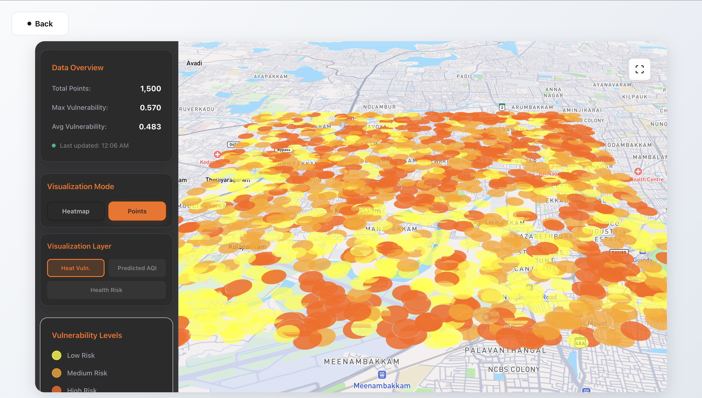

# HeatShield.ai


**HeatShield.ai** is an advanced urban climate monitoring platform that leverages satellite data and 3D visualization to identify heat vulnerability hotspots.

## Features
-   **Real-time Visualization:** Interactive 3D maps of heat vulnerability.
-   **AI-Powered Analysis:** Machine learning models trained on real Sentinel/Landsat data.
-   **City-Scale:** Currently live in **New Delhi, India**.



## Tech Stack
-   **Frontend:** Next.js 16, Deck.gl, Mapbox
-   **Backend:** Python (FastAPI), Serverless Functions
-   **Deployment:** Vercel

## Getting Started

1.  **Clone the repo:**
    ```bash
    git clone https://github.com/deepanjan1011/hotspots.git
    cd hotspots
    ```

2.  **Run Frontend:**
    ```bash
    npm install
    npm run dev
    ```

3.  **Run Backend:**
    ```bash
    pip install -r requirements.txt
    python3 -m uvicorn HotSpots-AI.server.main:app --reload --port 8000
    ```

Visit `http://localhost:3000` to see the application.
