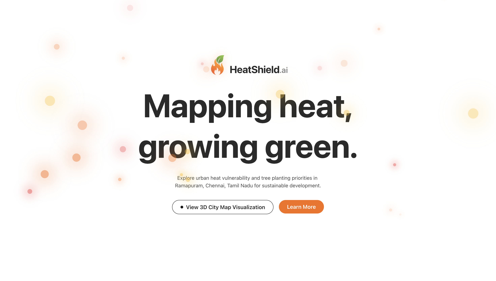
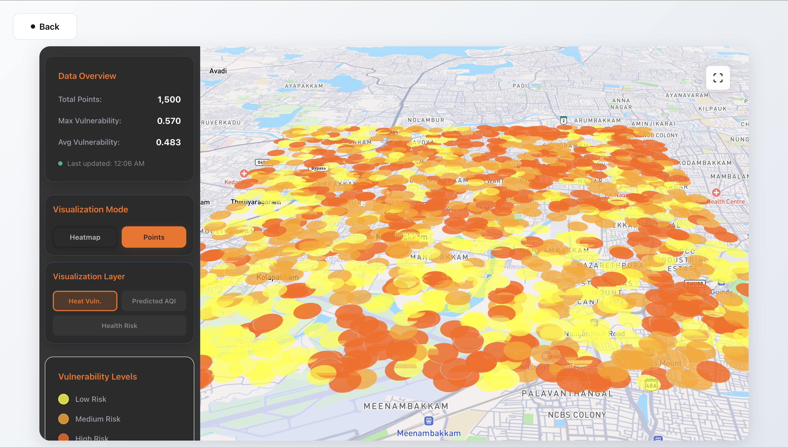

# HeatShield.ai



**HeatShield.ai** is an advanced urban climate monitoring platform that leverages satellite data and 3D visualization to identify heat vulnerability hotspots.

## Features
-   **Real-time Visualization:** Interactive 3D maps of heat vulnerability.
-   **AI-Powered Analysis:** Machine learning models trained on real Sentinel/Landsat data.
-   **City-Scale:** Currently live in **New Delhi, India**.



## Tech Stack
-   **Frontend:** Next.js 16, Deck.gl, Mapbox
-   **Backend:** Python (FastAPI), Serverless Functions
-   **Deployment:** Vercel

## Getting Started

1.  **Clone the repo:**
    ```bash
    git clone https://github.com/deepanjan1011/hotspots.git
    cd hotspots
    ```

2.  **Run Frontend** (from `HotSpots-AI`):
    ```bash
    cd HotSpots-AI
    npm install
    npm run dev
    ```

3.  **Run Backend (Python)**

    **You only need one virtual environment.** After cloning, create it **once** here:

    `HotSpots-AI/server/.venv`

    The repo does **not** ship a venv (it is gitignored). You may see several ignore rules such as `.venv/`, `venv/`, and `server/venv/` so that **whatever folder name someone uses locally** never gets committed. That is **not** an invitation to create multiple environments—pick **one** location: **`server/.venv`**, as below.

    ---

    **Easiest path (after first-time install):** from `HotSpots-AI`, start the API in a single step:

    ```bash
    npm run backend
    ```

    That runs `HotSpots-AI/server/run-dev.sh`, which starts Uvicorn on port **8000** and uses `server/.venv` if it exists (otherwise `server/venv`, then `python3`). You do **not** have to activate the venv first when you use this.

    ---

    **First-time setup** (one time per machine):

    ```bash
    cd HotSpots-AI/server
    python3 -m venv .venv
    source .venv/bin/activate   # Windows: .venv\Scripts\activate
    # Fish shell: source .venv/bin/activate.fish
    python -m pip install -r requirements.txt
    ```

    Then either use **`npm run backend`** from `HotSpots-AI`, or run Uvicorn yourself:

    ```bash
    cd HotSpots-AI/server
    source .venv/bin/activate   # Fish: source .venv/bin/activate.fish
    python -m uvicorn main:app --reload --port 8000
    ```

    **Dependencies:** use **`HotSpots-AI/server/requirements.txt`** for local development. The file **`HotSpots-AI/requirements.txt`** is a smaller set used for Vercel deployment limits, not for full local setup.

Visit `http://localhost:3000` to see the application.
